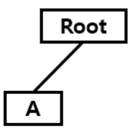
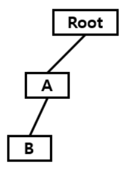
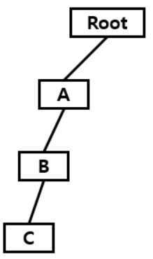
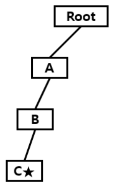
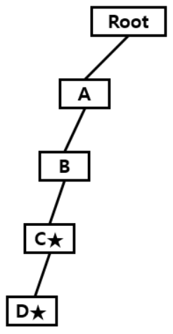
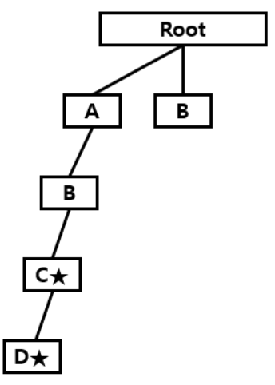
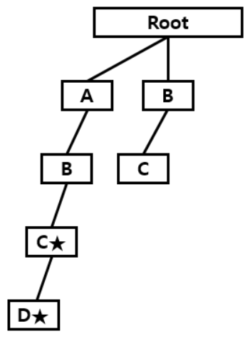

# **트라이**

**Abstract**

**서론**

우리가 여러 개의 문자열을 가지고 있을 때, **어떤 문자열이 그 문자열 중 하나인지 알아내는 방법**을 생각해보자.

단순하게 일일히 비교하는 방법이 있겠지만, 이러한 방법은 매우 비효율적이다. 최대 길이가 M인 문자열 N개의 집합에서 마찬가지로 최대 길이가 M인 문자열이 그 문자열의 집합에 포함되는지를 일일히 확인하면 최악의 경우 O(NM)의 비교 횟수가 필요하다.

이때, 문자열을 효율적으로 저장하고 탐색할 수 있는 자료구조가 **트라이(Trie)**다. Prefix tree, Digital search tree, Retrieval tree라고 부르기도 한다. 프레드킨이 Re<u>trie</u>val tree에서 "Trie"라는 이름을 붙였다.

트라이는 특정 문자열을 찾는 작업을 O(N)만에 해결할 수 있다. 그래서 주로 검색어 자동 완성, 사전에서 찾기, 문자열 검사 등에서 많이 사용된다. 그러나 각 노드에서 자식들에 대한 포인터들을 배열로 모두 저장하고 있기 때문에 저장 공간의 크기가 크다는 단점도 있다.

**구조**

기본적으로 K진 트리의 구조를 띠고 있다. 우리가 영어사전에서 "computer"라는 글자를 찾으려면 우선 제일 첫 글자인 `c`의 색인을 찾은 후, `u`, `m`, ... 순서대로 찾아갈 것이다. 이것을 논리적으로 컴퓨터에 적용한 구조가 바로 트라이 구조이다.

문자열의 목록이 `A`, `to`, `tea`, `ted`, `ten`, `i`, `in`, `inn`이라면 트라이는 다음과 같다.


루트 노드가 되는 가장 최상위 노드에는 어떠한 단어도 들어가지 않고, 루트 아래 노드부터 문자열의 접두사가 하나씩 나타나게 된다. 즉, `tea`는 `t` -> `te` -> `tea` 순으로 이루어지는데 이것은 모두 `tea`의 접두사이다. 즉, `tea`가 `te`를 포함한다는 사실도 트라이에서 알 수 있게 된다.

**Process (Ascending)**

1. 가장 초기 루트 노드에는 아무런 값도, 다른 노드도 존재하지 않는다.

   

2. `ABC`부터 트라이에 삽입해보자. 아직 아무런 문자도 삽입하지 않았으므로 가장 앞의 문자인 `A`부터 시작한다.

3. 트라이는 현재 문자로 이루어진 노드가 존재한다면, 그 노드로 다음 문자열을 탐색한다.
   그러나 루트 노드에 아무런 노드가 생성되지 않았기 때문에 노드를 할당받은 후, `A`를 가리키는 노드를 생성해준다.

   

   `B`와 `C`도 마찬가지로 노드가 존재하지 않기 때문에 생성해준다.

   

4. 그 다음 문자열을 탐색하려고 보니 문자열이 끝나서 이제 더 이상 존재하지 않는다. 이제 삽입이 끝났기 때문에 끝난 문자열이라는 것을 표시해주기 위해서 C옆에 ★을 붙여둔다. (실제 코드에서는 `finish`로 표시했다.)

   

5. 다음 `ABCD`를 삽입해보자. 이미 `ABC`를 삽입할 때 만들어 놓은 `A`, `B`, `C` 노드가 이미 존재한다. 이런 경우, 노드를 새로 생성하지 않고 해당 노드를 통해 다음 문자로 이동한다. 마지막 노드인 `D`는 존재하지 않기 때문에 `C`의 자식 노드로 `D`를 생성해주고, 마찬가지로 문자열이 끝났으므로 끝났다는 표시를 해준다.

   

6. 새로운 문자열인 `BCG`를 삽입해보자. 루트 노드에서 `B`로 가는 노드가 생성되어있지 않기 때문에 `B` 노드가 생성될 것이다.

   

   그 다음 문자인 `C`로 넘어가보자. 그럼 의문이 들 수도 있다. 앞서 진행한 과정에서 `A` -> `B` -> `C`로 가는 경로가 존재하는데 똑같은 거 아닐까?

   그러나 우리가 지금 필요한 것은 루트에서 `A`, 그리고 `B`, `C` 순으로 가는 것이 아니라 루트에서 바로 `B`, 그리고 `C`로 이동하는 경로이다. 따라서, `B` 노드에도 `C` 노드가 생성된다.

   

7. 그 후, `C` 노드에서 `G` 노드로 연결된 노드가 없으므로, 노드를 생성해준 뒤 끝난 표시를 해준다.

   

8. 이후, 순차적으로 `ZYX`, `BDE`를 넣어보면 아래처럼 트라이가 구성된다.

   

**Code**

<details>
    <summary>보기</summary>
**Trie 전체코드**


```c++
class Trie{
public:
    bool finish;
    Trie* next[MAX];
    
    Trie() {
        finish = false;
        memset(next, 0, sizeof(next));
        return;
    }
    
    ~Trie(){
        for (int i = 0 ; i < MAX;i++){
            if(next[i])
                delete next[i];
        }
    }
    
    void insert(const char* key){
        if(*key == '\0'){// 문자열의 마지막인경우 finish
            finish = true;
        }
        else{ // 문자열의 마지막이 아닌경우
            int curr = *key-'0';
            if(next[curr] == NULL)// 해당 문자열까지 처음이면
                next[curr] = new Trie(); // Trie 동적할당
            next[curr]->insert(key+1);
        }
        return;
    }
    
    bool find(const char* key){
        if(*key == '\0') return finish; // 문자열의 끝에 도달했을때 finish값을 리턴
        
        int curr = *key - '0';
        
        if(next[curr] == NULL) return false; // 다음으로 이어지는 노드가없으면 false
        return next[curr]->find(key + 1);
    }
};
```

</details>

**시간복잡도**

문자열의 최대 길이가 M일 때, `Find`와 `Insert` 모두 문자열의 길이(트리의 최대 높이) 내로 끝나기 때문에 **O(M)**의 시간 복잡도를 가지는 것을 알 수 있다.

**공간복잡도**

위의 시간 복잡도 O(M)을 가지기 위해서는 다음 문자를 가리키는 노드가 필요하다. 예를 들어, 숫자에 대해 트라이를 만들어야 한다면 0~9, 총 10개의 포인터 배열이 있어야하며, 알파벳 소문자에 대해 트라이를 만든다면 a~z인 총 26개의 포인터 배열을 가지고 있어야 한다.

즉, 최종 메모리는 **O(포인터의 크기 \* 포인터 배열의 개수 \* 트라이에 존재하는 총 노드의 개수)**가 된다.

**장점**

* 내용

**단점**

* 내용

**참고**

**Radix tree (Compact prefix tree)**

트라이의 치명적인 단점인 공간에 대한 효율성을 최적화하기 위한 방법 중 하나이다. 아래 그림처럼 자식 노드가 하나밖에 없는 경우, 부모 노드에 모두 합치는 방식으로 필요한 메모리를 줄일 수 있다.


## 주석

<sup>[1](#footnote_1)</sup>

<a name="footnote_1">1</a> : 내용

## 참고

[링크](https://eun-jeong.tistory.com/29)