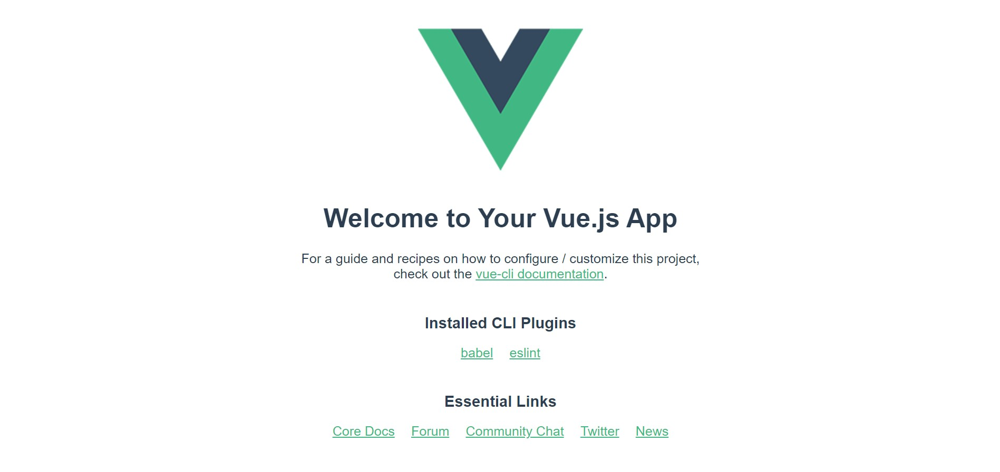

## 개발환경 구성

 **Node.js 설치**

- Javascript 기반의 언어인 Vue.js를 브라우저 환경이 아닌 곳에서 빌드하고 구동시키기 위해서는 별도의 Runtime 환경을 제공하는 node.js를 설치해야 한다.
- https://nodejs.org/ko/download/

- Node.js를 설치하게 되면 Node Package Manager인 NPM은 자동으로 설치된다. 이를 통해서 원하는 패키지를 설치할 수 있다. npm install ~. 작성한 코드를 빌드하고 서버를 켜는 행위도 npm을 통해 수행할 수 있다.

**Vue설치**

- ```
  npm install vue
  ```

- vue cli 설치

  ```
  npm install @vue/cli
  ```

**Vue 프로젝트 시작**

- ```
  vue create 프로젝트이름
  ```

- ```
  npm run serve
  ```

  

