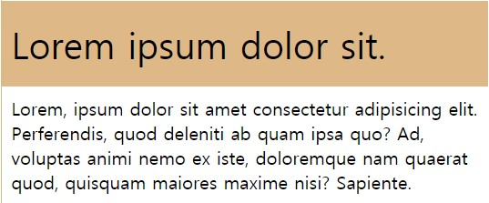

# CSS

> Cascading Style Sheet

**종류**

- Author Style : 개발자가 지정한 style

- User Style : 사용자가 지정한 style

- Browser : 브라우저

  > Cascading의 의미는 Autor -> User -> Browser 순으로 스타일을 찾는다는 의미이다.
  >
  > !important 사용시 이러한 Cascading을 끊어 낼 수 있다. 하지만 안쓰는 것이 권장된다.(좋지않은 코드)

**기본구조**

```css
select{
	property : value;
}
```

### 선택자(selectors)

> 엘리먼트에 가장 가까운 css가 적용된다.

- **Universal** : *****

  - 모든 엘리먼트에 적용

- **type** : **Tag**

  - ```css
    li {
      color: blue;
    }
    ```

    li 태그에 적용된다.

  - ```css
    A B{
        color : blue;
    }
    ```

  

- **ID** : **#id**

  - ```css
    #special {
      color: pink;
    }
    ```

    special이라는 id를 가진 엘리먼트에 적용된다.

  - ```css
    li#special {
      color: red;
    }
    ```

    li중 special이라는 id를 가진 엘리먼트만 적용된다.

- **Class** : **.class**

  - ```css
    .red {
      width: 100px;
      height: 100px;
      background: yellow;
    }
    ```

    red라는 class 이름을 가진 엘리먼트에 적용된다.

- **State** :  **:**

  - ```css
    button:hover {
      color: red;
      background-color: beige;
    }
    ```

  - button 태그가 hover상태가 되면 적용된다.

- **Attribute** : **[ ]**

  - ```css
    a[href="www.naver"] {
      /* href가 www.naver로 시작하는 a에 대해 적용 */
      color: purple;
    }
    ```

  - a태그중 href가 www.naver인 엘리먼트에 적용된다.

  - a[href^="www"] : href가 www로 시작되는 엘리먼트

  - a[href$=".com"] : href가 .com으로 끝나는 엘리먼트

  - a[href*="ww"] : href중 ww가 존재하는 엘리먼트

- **추가**

  - A B : A에 속한 B에 적용된다.
  - A, B : A, B 모두 적용된다.
  - A + B : A옆의 B에 적용된다.(하나)
  - A~B : 옆의 모든 B에 적용된다.
  - A>B : A의 직속자식인 B에 적용된다.
  - A B:first-child : A의 자식요소인 B중 첫번째 B에 적용된다.
  - A B:only-child : A의 자식인 B중 하나만 존재하는 B에 적용된다.
  - A B:last-child : A의 자식인 B중 가장 마지막에 위치한 B에 적용
  - A B:nth-child(3) : A의 자식인 n번째 B에 적용
  - B:nth-last-child(2) : 자식엘리먼트 중 n번째 B에 적용
  - A:first-of-type : 첫번째로 등장하는 A에 적용
  - A:nth-of-type(even) : 모든 짝수번 A에 적용(홀수 odd)
  - A:nth-of-type(2n+3) : 3부터 시작해 2번째마다 적용
  - A:only-of-type : ~~에 속한 A중 하나만 존재하는 A만 적용
  - last-of-type : 해당 타입을 가진 것중 마지막에 존재하는 것들만
  - A:empty : 자식요소가 없는 A만 적용
  - A:not(.small) : 클래스가 small이 아닌 A만 적용
  - [for] : for이라는 속성을 가지는 것들에 적용

### Display & Position

**Display**

- inline : 크기와 상관없이 컨텐츠 외부를 둘러싸는 것(컨텐츠가 없으면 크기가없음). 공간이 남아있으면 수평으로 배열된다.
- inline-block : 수평으로 배열되지만, 크기 지정이 가능하다.
- block : 크기 지정이 가능하고 수직으로 배열된다.

**position**

- static : default값. 
- relative :  원래 자신의 위치를 기준으로 상대적인 위치를 지정함
- absolute : 가장 가까운 static이 아닌 부모요소를 기준으로 상대적인 위치를 지정함
- fixed : 윈도우를 기준으로 상대적인 위치를 지정함
- sticky : 스크롤링을 해도 붙어있음 

### FlexBox

> position을 유연하게 적용하기 위해 만들어진 속성
>
> container과 item에 적용되는 속성이 각각 다르다.

**container속성**

- display
- flex-directiono
- flex-wrap
- flex-flow
- justify-content
- align-items
- align-content

**item속성**

- order
- flex-grow
- flex-shrink
- flex
- align-self

**축**

- FlexBox에서 수평 또는 수직 중 하나가 중심축이 되면 나머지 하나는 반대축이 된다.

#### **attribute**

**container**

- flex-direction : 기본축을 지정하는 속성(default : row)
- flex-wrap : 자식요소들의 크기가 화면크기를 넘어서면 다음줄로 바꿀지(wrap), 크기를 줄일지 결정(nowrap) (default: nowrap)
- justify-content : 중심축에서 컨텐츠 배열방식을 지정하는 속성(default : flex-start)
- align-items : 반대축에서 컨텐츠 배열방식을 지정하는 속성
- align-content : 반대축에서 컨텐츠 배열방식을 지정하는 속성

**Item**

- flex-grow : 배율에 맞춰서 빈부분을 채움
- flex-shrink : 사이즈가 줄어드는 배율을 설정
- flex-basis : 지정한 %에 따라 늘어나거나 줄어드는 배율을 설정
- align-self : 아이템 하나만 반대축에 대해 배치

### 반응형 웹

- 일반적으로 mobile, tablet, desktop으로 나누어서 크기를 나눈다.

  - mobile : 320~480px
  - tablet : 768~1024px
  - desktop : 1024px~

- media 쿼리(MDN에서 확인)

  ```css
  @media screen and (min-width: 800px){
      .container{
          width: 50%;
      }
  }
  ```

  스크린 최소 넓이가 800px일때 적용할 css

## CSS Units

> css에서 사이즈를 결정하는 value

**Absolute**(절대값)

- 매우 다양한 단위들이 있지만 px을 제외한 값들은 물리적으로 의미가 있는  unit이라 잘 사용하지 않는다.
- 절대값을 사용하면 페이지의 크기 조절에 영향을 받지 않으며 브라우저의 Font-size를 바꿔도 반응하지 않게된다.
- **px**(pixel)
  - 모니터에서 표현할 수 있는 가장 작은 단위

**Relative**(상대값)

- **em**
  - 부모요소의 font-size의 배율을 가진다.(지정된 font-family에 상관없이)
  - 기본적으로 브라우저의 body에 적용된 font-size가 없다면, 16px이다.
  - 즉, body바로 밑의 element의 8em = 16 * 8 px = 128px
  - 해당요소의 자식요소의 0.5em = 128 * 0.5px = 64px
- **rem**
  - root요소의 font-size의 배율을 가진다.(지정된 font-family에 상관없이)
  - 즉, body바로 밑의 element의 8em = 16 * 8 px = 128px
  - 해당요소의 자식요소의 0.5em = 16 * 0.5px = 8px
- **vw, vh**
  - ViewPort(브라우저)크기의 n%를 가진다.
  - 100vh , 100 vw : 브라우저를 가득채움.
- **%**
  - em과 동일하다.(but 백분율)
  - 8em = 800%

#### 구분

**기준이 되는 요소**

- 부모요소
  - em, %
- 브라우저
  - rem, v*

**관계**

- font-size에 따라
  - em, rem
- 요소의 크기에 따라
  - %, v*

#### 실제 사용하는 방법

- 컴포넌트 설계시 해당 컴포넌트가 어디에 위치하더라도 일정한 값을 가져야 한다면 rem을 사용하고, 위치에 따라 크기가 달라져야 한다면 em을 사용하는 것이 좋다.

- ex)[demo1](../../3.Projects/2.Pratice/practice_css/em_rem/rem_demo/rem_demo.html)

  

  **css**

  ```css
  .component {
    width: 50%;
    border: 1px solid burlywood;
    font-size: 2rem;
  }
  
  .title {
    background-color: burlywood;
    padding: 0.5em 0.5rem;
  }
  
  .contents {
    font-size: 1rem;
    padding: 0.5em 0.5rem;
  }
  ```

  1. em, rem은 font-size에 영향을 받으므로 font-size가 일정하다면 어쨌든 절대적인 요소이다. 따라서 width, height등을 지정할 때는 %, v*, flex를 사용하는 것이 좀 더 반응형 처럼 보인다.
  2. padding을 지정할 때, 무조건 em으로 지정하면 상하 padding은 적절하지만 좌우 padding은 줄이 맞지않아 보기에 좋지 않을 수 있다. 따라서 상하 padding은 em, 좌우 padding은 rem으로 지정하면 좀 더 보기 좋다.(적절한 사용이 필요)
  3. font-size는 em으로 지정하면, 어떤 컴포넌트 안에있는지 계산해야하므로 rem을 사용하는 것이 좋다.
  4. 반응형 CSS를 적용하기 위해 @media쿼리를 이용할 때, max-width를 px이 아닌 rem으로 지정해주는 것이 좋다.

### Tip

- 반복되는 구조 생성방법
  - div.container>div.item.item${$}*10: container이라는 class를 갖는 div 안에 item이라는 클래스, item$클래스를 갖는 div를 넣고 컨텐츠로 $를 가진다. 이를 10개 만든다. $자리에는 1~10까지 자동으로 들어간다.
- 컨테이너를 화면 100%로 만들때, height:100%로 하게되면 상위태그인 body와 html이 100%가 아니기 때문에 높이가 지정되지 않는다. 따라서 body, html에 height:100%를 지정하거나 애초에 컨테이너 height:100vh로 하게 되면 화면 전체 높이를 설정할 수 있다.
- 

### 참고

- CSS 연습 사이트 : https://flukeout.github.io/
- CSS 호환성 여부 확인 : https://caniuse.com/
- 색깔 모음집 : https://material.io/resources/color/#!/?view.left=0&view.right=0
- flex-box간단 설명 : https://css-tricks.com/snippets/css/a-guide-to-flexbox/
- flex-box 연습 사이트 : https://flexboxfroggy.com/#ko
- 무료 로고 : https://fontawesome.com/
- 무료 폰트 : https://fonts.google.com/
- px을 em으로 변환해주는 사이트 : http://pxtoem.com/