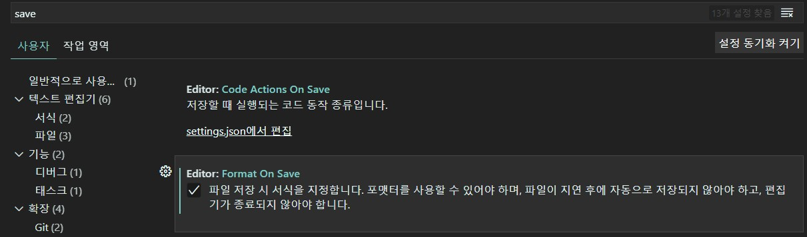
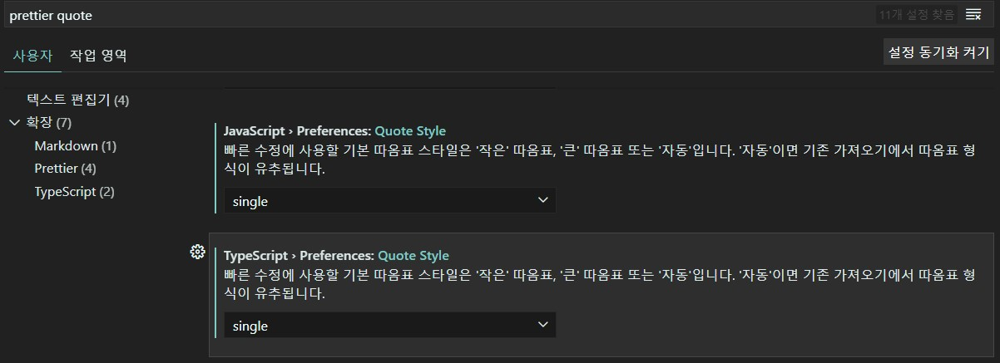
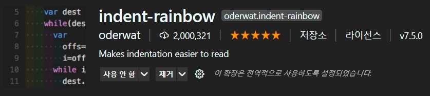
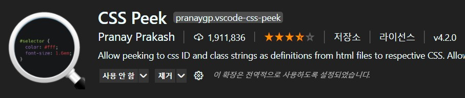

# **개발환경**

### Visual Studio Code

- Text Editor의 한 종류로 매우 다양한 Plugin과 Extension을 제공하기 때문에 IDE 못지 않은 개발이 가능하다.

###  단축키

- Ctrl + Shift + p : 커맨드 팔레트
- Ctrl + Shift + v : 마크다운 형식으로 보기

### Extensions

- VS Code의 색상을 바꿔준다.

- VS Code의 아이콘을 바꿔준다.

- 코드를 편리하게 포맷팅해준다.

- 적용

  - 

    setting에서 save를 검색해 Format On Save를 체크해준다.

  - 

    setting에서 prettier을 검색해 탭 길이를 2칸으로 맞춰준다. 기본은 4칸인데 코드가 길어지면 한눈에 안들어옴.

  - 

    Quote 스타일은 JavaScript와 TypeScript를 Single로 설정한다.

- 괄호 Pair간에 색깔을 구별해 파악을 쉽게 한다.

- 들여쓰기에 색깔을 지정해 조금 더 쉽게 눈에 띄게 한다.

- Html 수정시 태그 쌍 중 하나만 수정해도 자동으로 맞춰준다.

- Ctrl + 마우스 클릭 으로 id나 class 이름을 누르면 해당 CSS가 정의된 곳으로 자동이동된다.(동작 X -> Vue 프로젝트에서는 안된다? 확인필요)

- CSS 적용시 class or id 자동완성 가능하게 함(동작 X -> Vue 프로젝트에서는 안된다? 확인필요)

- 바닐라 Javascript로 Html개발시 동적으로 확인할 수 있도록 해줌
- Open with liveServer로 실행(Alt + O)

- html에서 이미 지정된 클래스 이름등을 css에서 자동완성 시켜준다.

## 주석

[1](#footnote_1)

<a name="footnote_1">1</a> : 내용

![img](../../2.Pictures/