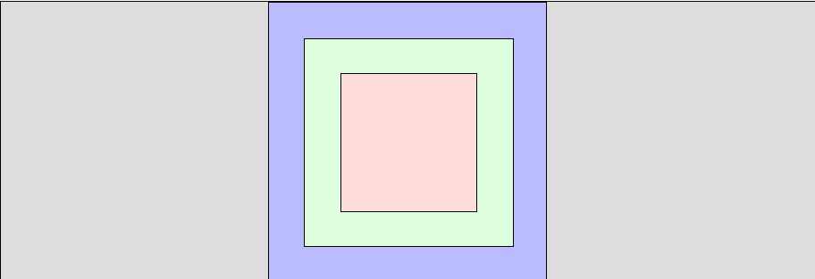

# Margin, Padding



**HTML**

```html
<div id="test1-margin">
  // 파란색 영역
  <div id="test1-padding">
    // 초록색 영역
    <div id="test1-content">// 빨간색 영역</div>
  </div>
</div>
```

**test1-margin**(파란색 영역)

```css
#test1-margin {
  background-color: #bbf;
  width: 200px;
  height: 200px;

  border: 1px solid black;
  box-sizing: border-box;

  display: flex;
  justify-content: center;
  align-items: center;
  margin: 0 auto;
}
```

- box-sizing : 요소의 너비와 높이를 계산하는 방법을 지정하는 속성
  - content-box : 길이를 계산할 때, width + border + padding으로 계산한다.
  - border-box : 길이를 계산할 때, width크기에 맞춰서 content의 실제 길이를 줄인다. width = border + padding + 실제 길이
- display : flex
  - [참고](https://heropy.blog/2018/11/24/css-flexible-box/)
  - justify-content : 내부 요소들의 수평 정렬
  - align-items : 내부 요소들의 수직 정렬 ( 줄 마다 적용)
- margin : 0 auto; : 자신을 부모요소의 가운데에 위치 시킬때 자주 사용한다. 위아래 여백 0 좌, 우 여백을 auto로 지정함으로써 가운데정렬한다.

**test1-padding**

```css
#test1-padding {
  background-color: #dfd;
  width: 150px;
  height: 150px;

  border: 1px solid black;
  margin: 25px;
  padding: 25px;
  box-sizing: border-box;

  display: flex;
  justify-content: center;
  align-items: center;
}
```

- margin : 요소의 바깥에 상, 하, 좌, 우 여백을 둔다. 화면에서 파란색 영역이 margin 영역이다.
- padding : 요소의 안쪽에 상, 하, 좌, 우 여백을 둔다. 화면에서 초록색 영영이 padding 영역이다. 실제 content는 빨간색 영역에 표시된다.

**test1-content**

```css
#test1-content {
  background-color: #fdd;
  border: 1px solid black;
  width: 100%;
  height: 100%;
}
```

> Margin 병합현상 때문에 각 div마다 border을 지정해 테두리를 지정해주지 않으면 margin이 제대로 지정되지 않는 문제점이 있었다. [Margin Collapsing](https://velog.io/@ursr0706/%EB%A7%88%EC%A7%84margin)에 대해서 알아보자.
